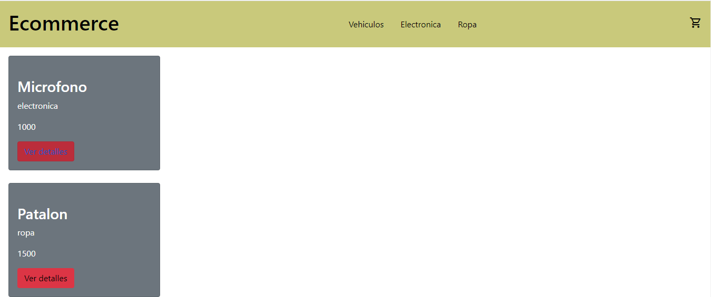
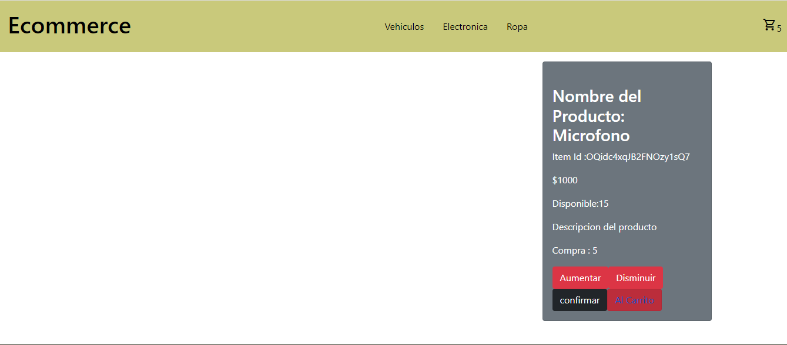
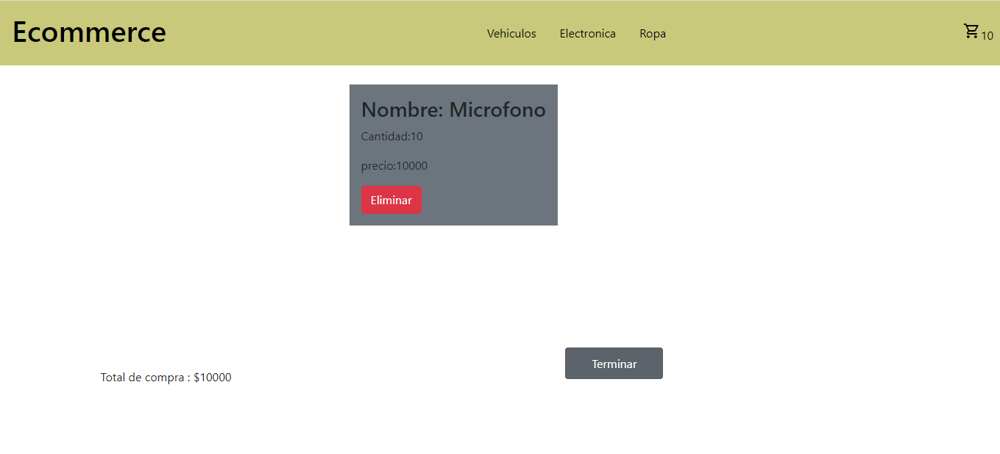
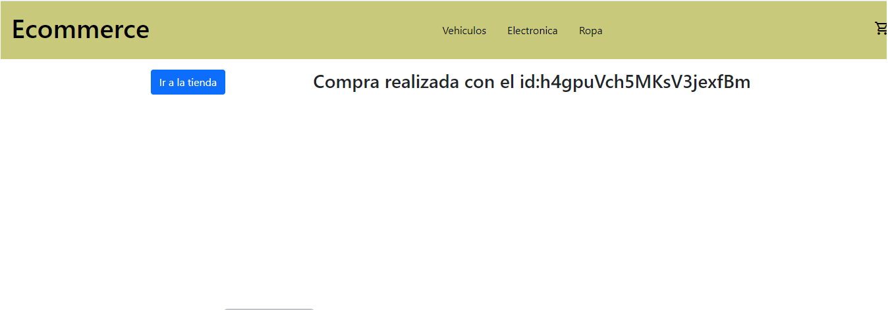

# Ecommercer Practica

Este proyecto fue diseñado como practica para iniciar futuros. Simulando compras online

## Herramientas usadas:

1. Firebase: Se utilizo como para simular base de datos para pruebas en el proyecto

2. React router dom: Se uso para generar routas, y eliminar el uso de varias paginas html

3. Sass: se uso para dar estilo a la pagina

### Pasos de uso
1. npm i ecommerce-portal 
2. npm start en el repositorio

A continuacion algunas imagenes mostrando el funcionamiento

Seleccionamos nuestro producto de la lista de items.

Vemos los detalles, elegimos la cantidad del producto deseado

agreamos dicha cantidad al carrito

Listo! Se nos genero un id de compra!

